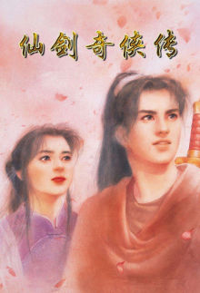

### 博德之门3 ———— 绝对的年度游戏，TGA佳作

#### 一个游戏的好坏绝对不是公司营收的决定因素，却是玩家口碑的决定因素

接触Baldur's Gate还是在21年的9月，当时是因为拉瑞安工作室的另外一款神作神界原罪2才入的坑。说到神界原罪，总是让我想起那些大学里跟龙哥打游戏而挥霍的青春。后面有机会，我也记录一些跟龙哥的故事。毕竟他也是一个神人了。

玄幻题材一直是我喜欢的游戏题材，最初可以追溯到仙剑奇侠传

这个跟博德之门有什么关系？

游戏的核心玩家群体类似，都是对内容很挑剔的玩家，而不是为了爽而爽的。博德之门是一款欧美玄幻（魔幻）题材的游戏，说白了都是现实中无法体验，但却是我们90后一代人从小听来的故事的一个具象化。仙剑中的元素就存在着西游记的影子，而西游记不过是中国神话的一部分，可以说仙剑的成功离不开中国神话对中国读者的熏陶。博德之门的火热也离不开欧美神话在全世界的普及，雷神4都上映了，中国大概有一亿人看过敷脸吧？这就是欧美神话或者说北欧神话的普及。

这也就不难理解为什么博德之门3最多同时在线人数能达到87万，且占据了24%的STEAM玩家时长。大家都爱听故事，爱看故事，爱体验故事。

中国市场再难出一个类似的游戏了，有一部分原因是猴子被玩烂了，西游被魔改了，不是说对经典二次创作不好。而是，有这些时间，为啥不愿意创作一个新的神话呢？当然也不乏新的文创小说，却局限在后宫的数量和扮猪杀虎的鸦片感上，俗称小白文。看完索然无味，也并不会记得具体讲了什么，只记得配角们都没有脑子。

大家之想写一个孙悟空，却忘了八戒，老沙，师傅，还有那些特色各异的妖魔鬼怪。这些都是故事的一部分，而不是故事的全部。这也是为什么博德之门3的故事会让人印象深刻，因为它不仅仅是一个故事，而是一个世界观，一个世界观的构建需要很多人的努力，而不是一个人的努力。

游戏需要世界观，而且只能是原创的。毕竟我们只能走一辈子的路，谁也不愿意做一个影子吧？