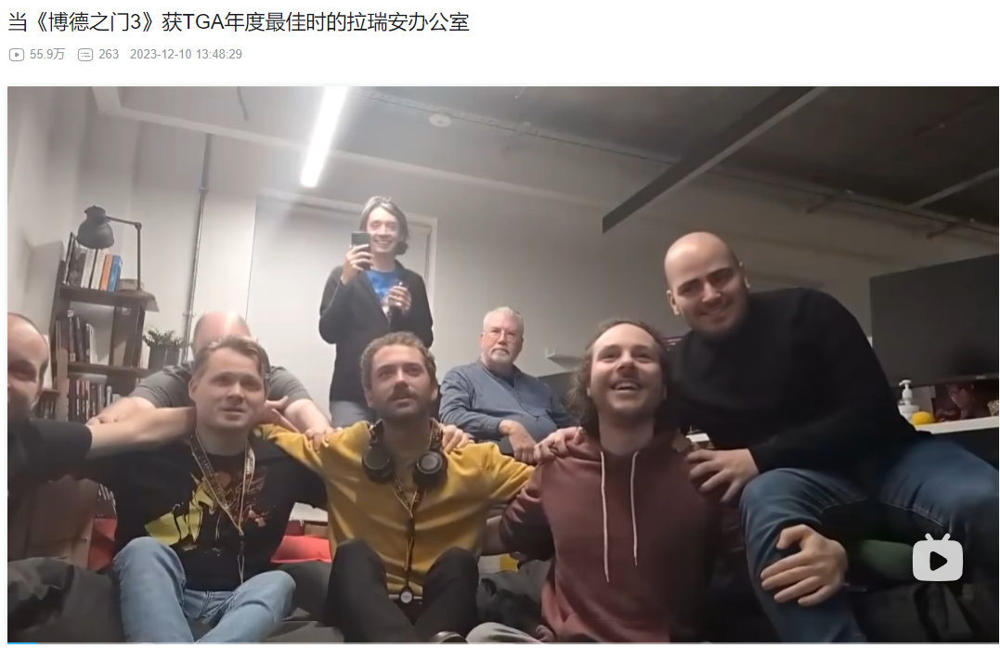

### 博德之门3  ———— 恭喜拉瑞安工作室TGA大满贯

#### 他们替我实现了梦想

首先恭喜博德之门获得以下六个奖项，特别是TGA年度最佳游戏：

年度最佳游戏

最佳演出

最佳社区支持

最佳角色扮演游戏

最佳多人游戏

玩家心声奖

 

2023年的TGA大奖已经过去了几个月，一直在忙于各种事件，没有时间来写这篇文章。
其次，每次看到博德之门3得奖的新闻，总感觉眼睛进了沙子一样。

很多人没法理解这种特殊的情感，因为对于大部分人，包括大部分的玩家，这仅仅是一款游戏。

容我讲个故事，小时候我喜欢玩游戏，它给我快乐。为了尊重游戏，我狠狠地玩，他们都叫我网瘾少年，用现在的话说可能最多算个二次元浓度不高的伪二次元。

偶尔，大人们也会玩游戏甚至陪我一起玩游戏，但是如果说想做游戏，那是不可能同意的！我的父亲总希望我成为一个医生，但我觉得手术只能让人类苟命，而游戏让你获得游戏世界中的新生，用句俗套的话说，在游戏里，YOU CAN BE ANYONE。我年轻的时候，很难分区虚拟和现实的边界，哪怕是现在，我也不能绝对的肯定我生活的世界是真实存在的，而不是一个大型模拟器。

后来，毕业了，工作了，进了一家游戏公司。哎，这里的人真的是讲话都好听。

有时候，我常常觉得我就像一个刑满释放的犯人，这份工作对我来说是一种解脱。

转眼，就是三年，家里人似乎理解了，而我，也释怀了。

转眼，就三十了，好像就这样度过了平凡的一生。

转眼，二十年了，还喜欢游戏，玩的少了，把热爱埋葬了，越存越多。

下面这张图是拉瑞安工作室得奖前的瞬间：

得奖后：

煽情到此为止，该去写代码了。